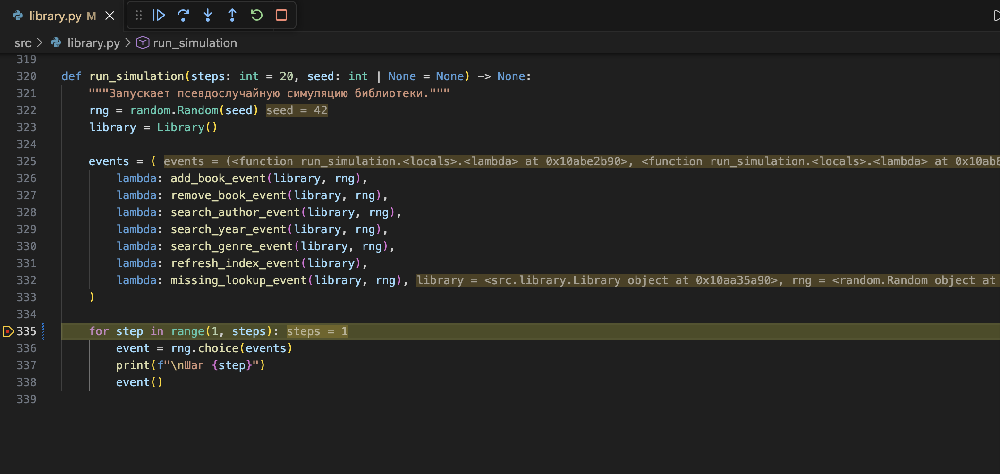
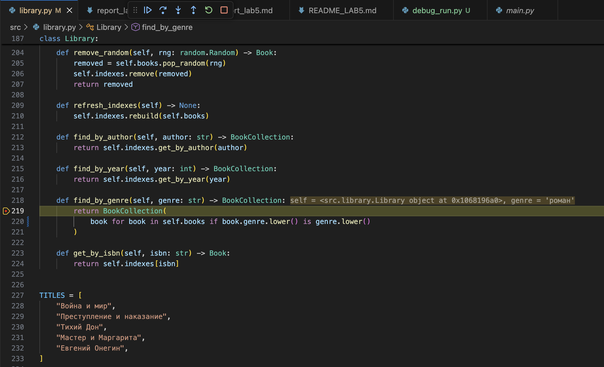
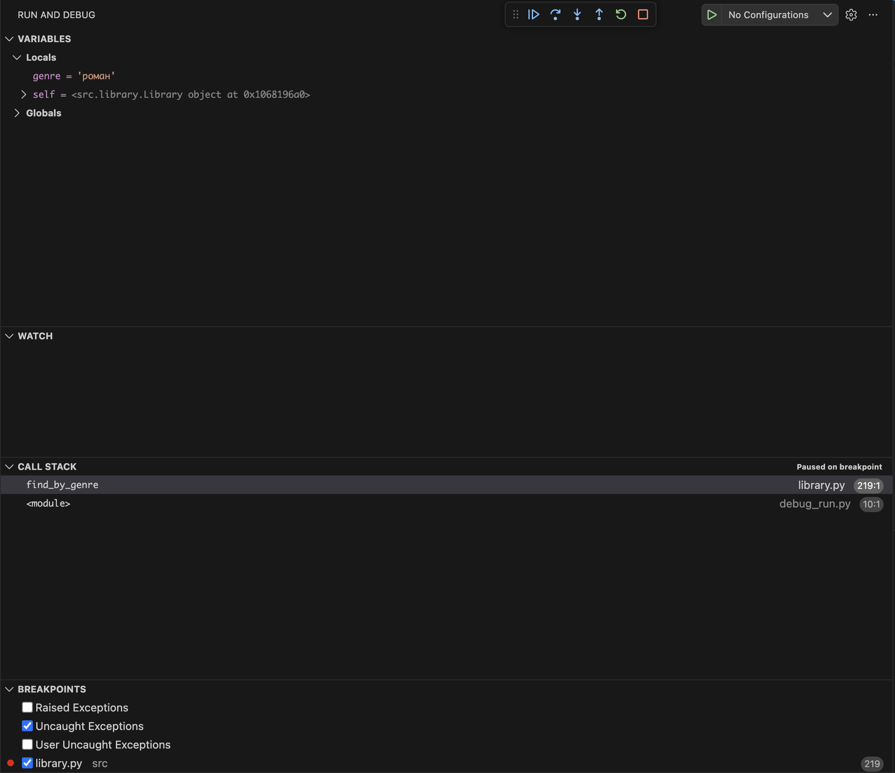

### Ошибка 1 - ошибка границы цикла (off-by-one)
Место: src/library.py, функция run_simulation

Симптом:
При запуске симуляции с steps=1 не выполняется ни одного шага (лог пустой).

Как воспроизвести:
Запустить:
`python -c "from src.library import run_simulation; run_simulation(steps=1, seed=42)"`

Отладка:
Установлен breakpoint на строке цикла `for step in range(1, steps):`.
В отладчике видно, что `steps = 1`, а диапазон `range(1, steps)` превращается в `range(1, 1)` (пустой), поэтому тело цикла не выполняется.
Call Stack показывает остановку в `run_simulation` (вызов из debug_run.py).

Причина:
Неверная граница диапазона: используется `range(1, steps)`, который не включает последний шаг.

Исправление:
Заменено на:
`for step in range(1, steps + 1):`

Проверка:
Повторный запуск с `steps=1` выводит `Шаг 1` и выполняет событие.

Доказательства:

**Точка останова в цикле симуляции:**

**Кадр стека и значения локальных переменных:**

### Ошибка 2 - сравнение через is вместо ==
Место: src/library.py, метод find_by_genre

Симптом:
Поиск по жанру не находит книги, хотя в библиотеке присутствует книга с данным жанром.

Как воспроизвести:
Создать библиотеку, добавить книгу с жанром "роман" и выполнить поиск через метод `find_by_genre("роман")`.

Отладка:
Установлен breakpoint в методе `find_by_genre` на строке с условием фильтрации.
В отладчике видно, что значение переменной `genre` равно `"роман"`,
однако сравнение `book.genre.lower() is genre.lower()` возвращает False, из-за чего книга не попадает в результирующую коллекцию.
Call Stack показывает остановку в методе `find_by_genre` (вызов из debug_run.py).

Причина:
Использовано сравнение строк через оператор `is`, который проверяет идентичность объектов в памяти, а не равенство их значений.
Метод `lower()` создаёт новые объекты строк, поэтому сравнение через `is` почти всегда возвращает False.

Исправление:
Заменено на сравнение через оператор `==`:
`book.genre.lower() == genre.lower()`

Проверка:
После исправления поиск по жанру возвращает корректное количество книг
(книга с жанром "роман" успешно находится).

Доказательства:

**Точка останова в методе find_by_genre:**

**Кадр стека и значения локальных переменных:**

